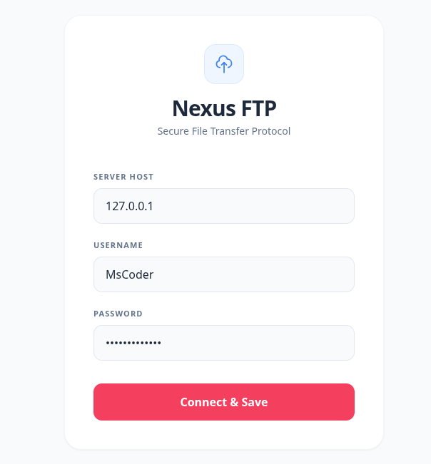
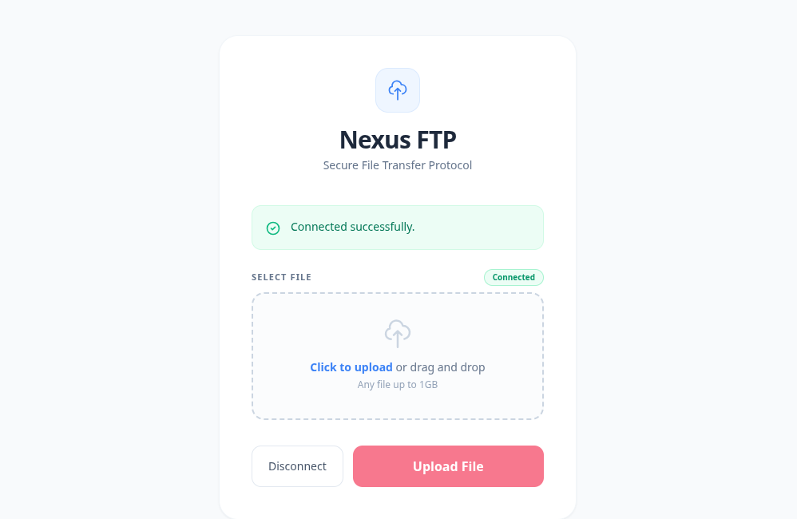
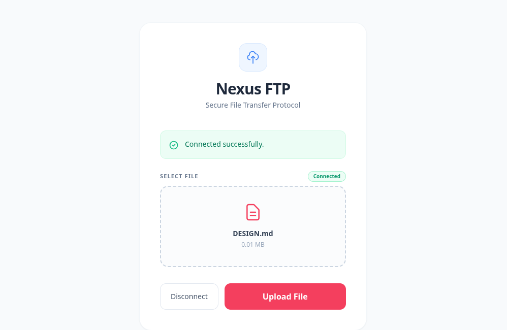
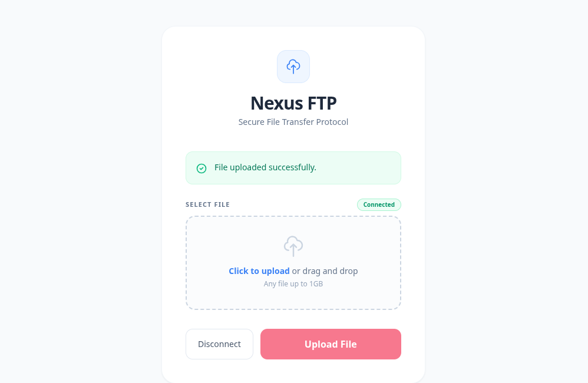
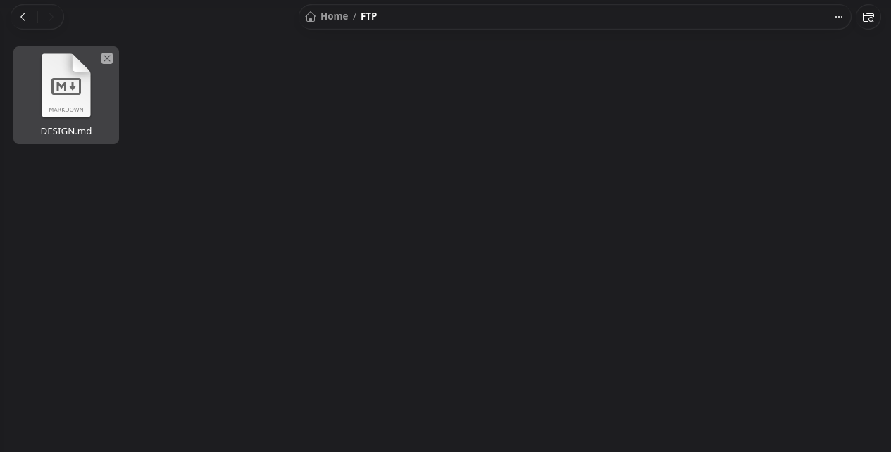
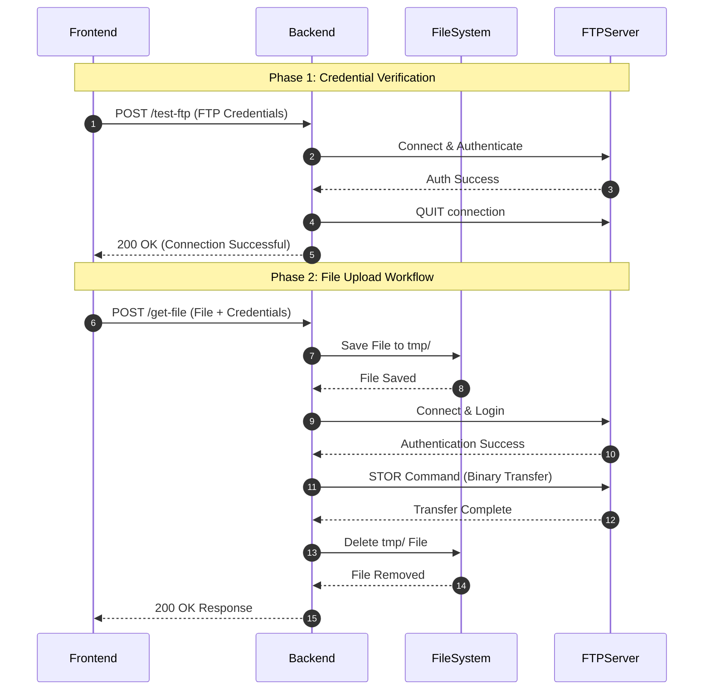

# Nexus FTP File Upload 🌐

## 📖 Overview
Nexus FTP is a robust file transfer solution featuring a Python Flask backend. It automates secure file uploads to a remote FTP server through a clean REST API architecture.

### 📸 App Interface






## 💡 Workflow of the App
1. The **Frontend** sends a `POST` request to the backend's `/test-ftp` endpoint with the user's FTP credentials.
2. The **Backend** attempts to connect to the target FTP server on port 21. 
3. If the connection and login are successful, it immediately closes the connection and returns a `200 OK`. The frontend then saves these credentials.

### Phase 2: File Upload (`/get-file`)
1. The **Frontend** sends the selected file along with the saved credentials to the `/get-file` API.
2. The **Backend** temporarily saves the file to a local `tmp/` directory to ensure data integrity.
3. The **Backend** initiates a new secure connection to the FTP server and pipes the binary file using the `STOR` command.
4. Once the transfer completes, the **Backend** deletes the temporary file to clean up the workspace and returns a success response to the Frontend.



## 🚀 How to Setup the App

### 1. Install Dependencies
Ensure you have Python installed, then install the required backend dependencies:
```bash
pip install -r requirements.txt
```

### 2. Run the Backend Server
Start the Flask API server:
```bash
python3 app.py
```
The backend server will run continuously on `http://127.0.0.1:8080`.

---

## ⚠️ Important FTP Server Configuration (e.g., FileZilla Server)
If you are hosting the FTP server yourself, you **must** configure it correctly for the backend to communicate with it, otherwise you will encounter `550 Permission Denied` or connection errors:

1. **Protocol Configuration**: 
   Ensure your FTP server's protocol is set to **"explicit FTP over TLS"** or **"insecure plain FTP"**. Ensure your Python code (`FTP()` vs `FTP_TLS()`) matches the server's requirement. *Note: Python's standard `ftplib` does not support TLS session resumption, so if your server enforces that, you must use insecure plain FTP or disable session resumption.*
2. **Directory Permissions (OS Level)**: 
   Ensure the system user running the FTP Server has actual OS-level **Write** permissions to the target native directory (e.g., `chmod 777 /path/to/ftp`).
3. **Parent Directory Traversal**: 
   If your FTP folder is nested inside a restricted user directory (like `/home/username/FTP`), ensure the parent directory (`/home/username`) has execute/traversal permissions (`chmod a+x /home/username`). Otherwise, the FTP service cannot physically reach the folder, regardless of virtual permissions.

---

## 🧪 How to Test the API

You can easily test the backend APIs using `cURL`, Postman, or any API client.

### 1. Test FTP Connection (`/test-ftp`)
Validates your credentials and connection without actually uploading a file.
```bash
curl -X POST http://127.0.0.1:8080/test-ftp \
  -F "host=127.0.0.1" \
  -F "user=your_username" \
  -F "password=your_password"
```

### 2. Test File Upload (`/get-file`)
Uploads a file to the FTP server.
```bash
curl -X POST http://127.0.0.1:8080/get-file \
  -F "host=127.0.0.1" \
  -F "user=your_username" \
  -F "password=your_password" \
  -F "file=@/path/to/your/local/test_file.txt"
```
